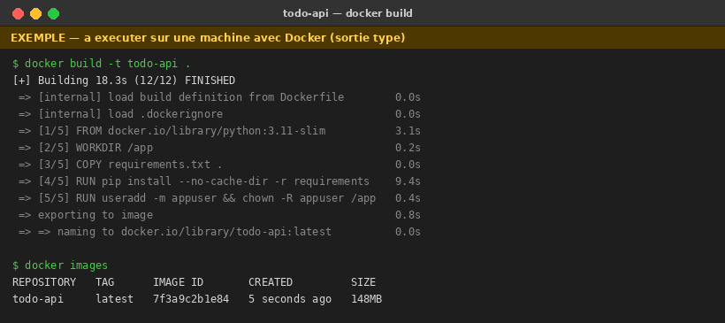
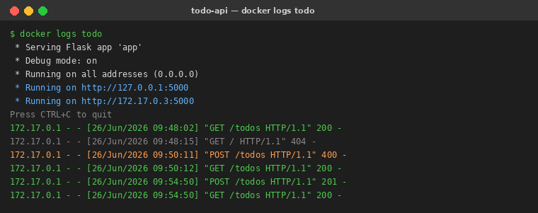
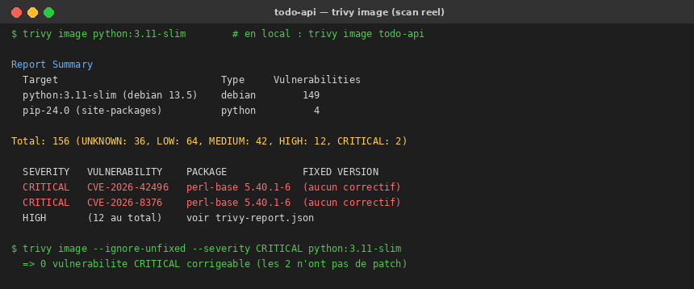
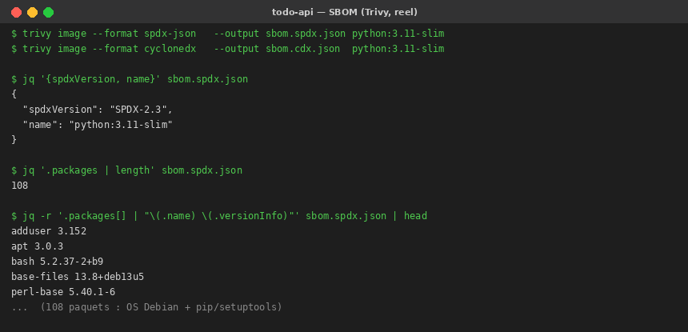
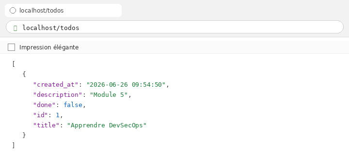

# Todo API — Flask + SQLite

API REST minimaliste de gestion de tâches (Todo), développée avec **Flask** et **SQLite**, couverte par des **tests unitaires `pytest`**. Projet réalisé dans le cadre du module *Développement et Tests de l'Application Python* (TP DevSecOps).

[](docs/pytest_screenshot.png)
[](https://www.python.org/)
[](https://flask.palletsprojects.com/)
[](https://hub.docker.com/r/oumsz/todo-api)

---

## Sommaire

1. [Architecture du projet](#1-architecture-du-projet)
2. [Prérequis](#2-prérequis)
3. [Installation pas à pas (et pourquoi)](#3-installation-pas-à-pas-et-pourquoi)
4. [Lancer l'application](#4-lancer-lapplication)
5. [Documentation des endpoints](#5-documentation-des-endpoints)
6. [Tests manuels avec curl](#6-tests-manuels-avec-curl)
7. [Tests unitaires avec pytest](#7-tests-unitaires-avec-pytest)
8. [Sécurité et bonnes pratiques](#8-sécurité-et-bonnes-pratiques)
9. [Commandes Git / GitHub utilisées](#9-commandes-git--github-utilisées)
10. [Conteneurisation avec Docker](#10-conteneurisation-avec-docker)
11. [Analyse de sécurité : Trivy et SBOM](#11-analyse-de-sécurité--trivy-et-sbom)
12. [Déploiement et promotion sur DockerHub](#12-déploiement-et-promotion-sur-dockerhub)

---

## 1. Architecture du projet

```
todo-api/
├── app.py              # Application Flask : routes CRUD + accès SQLite
├── requirements.txt    # Dépendances Python épinglées
├── test_app.py         # Tests unitaires pytest (9 tests, 1 par cas)
├── Dockerfile          # Conteneurisation de l'application (image légère, non-root)
├── .dockerignore       # Fichiers exclus du contexte de build Docker
├── docker-compose.yml  # Déploiement de l'image DockerHub (1 commande)
├── .gitignore          # Exclut la base SQLite, le venv, les caches, les secrets
├── README.md           # Ce fichier
├── trivy-report.json   # Rapport de scan de vulnérabilités (Trivy, JSON)
├── trivy-report.txt    # Rapport de scan de vulnérabilités (Trivy, table)
├── sbom.spdx.json      # SBOM au format SPDX
├── sbom.cdx.json       # SBOM au format CycloneDX
└── docs/
    ├── pytest_screenshot.png   # Preuve : exécution des tests pytest
    ├── tests_output.txt        # Sortie texte brute de pytest -v
    ├── docker_build.png        # Preuve : build de l'image
    ├── docker_logs.png         # Preuve : logs du conteneur (GET 200 / POST 201)
    ├── trivy_scan.png          # Preuve : scan Trivy (image todo-api)
    ├── sbom.png                # Preuve : contenu du SBOM
    └── app_browser.png         # Preuve : application accessible dans le navigateur
```

| Composant | Rôle |
|-----------|------|
| `Flask` | Micro-framework web : route les requêtes HTTP vers les fonctions Python. |
| `SQLite` | Base de données embarquée (un simple fichier `todos.db`), zéro serveur à installer. |
| `pytest` | Framework de tests : exécute les tests et fournit un rapport lisible. |

---

## 2. Prérequis

- **Python 3.10 ou supérieur** (`python --version` pour vérifier)
- **pip** (gestionnaire de paquets Python, livré avec Python)
- Le port **5000** doit être libre

---

## 3. Installation pas à pas (et pourquoi)

### 3.1. Récupérer le projet

```bash
git clone https://github.com/<votre-compte>/tp-devsecops-todo-api.git
cd tp-devsecops-todo-api
```

> *Pourquoi :* on récupère le code et on se place dans le dossier pour que toutes les commandes suivantes s'exécutent au bon endroit.

### 3.2. Créer un environnement virtuel

```bash
python -m venv .venv
# Linux / macOS
source .venv/bin/activate
# Windows (PowerShell)
.venv\Scripts\Activate.ps1
```

> *Pourquoi :* un environnement virtuel isole les dépendances du projet du Python système. On évite les conflits de versions entre projets et on garde une installation propre et reproductible.

### 3.3. Installer les dépendances

```bash
pip install -r requirements.txt
```

> *Pourquoi :* `requirements.txt` épingle des versions précises (`Flask==3.0.0`, `pytest==8.0.0`). Tout le monde installe donc exactement les mêmes versions → le projet se comporte de façon identique sur toutes les machines.

---

## 4. Lancer l'application

```bash
python app.py
```

Au démarrage, l'application :

- crée automatiquement la base SQLite `todos.db` (via `init_db()`) si elle n'existe pas ;
- écoute sur `http://localhost:5000`.

L'API est alors accessible sur **http://localhost:5000/todos**.

> *Astuce :* le chemin de la base est configurable via la variable d'environnement `DB_PATH`.
> `DB_PATH=/tmp/ma_base.db python app.py` lance l'API sur une autre base — c'est ce mécanisme qu'on réutilise dans les tests.

---

## 5. Documentation des endpoints

Base URL : `http://localhost:5000`

| Méthode | Endpoint | Description | Corps attendu | Codes de retour |
|---------|----------|-------------|---------------|-----------------|
| `GET` | `/todos` | Liste toutes les tâches | — | `200` |
| `POST` | `/todos` | Crée une tâche | JSON avec `title` (requis), `description`, `done` | `201`, `400` |
| `GET` | `/todos/<id>` | Récupère une tâche par son id | — | `200`, `404` |
| `PUT` | `/todos/<id>` | Met à jour une tâche | JSON `title`, `description`, `done` | `200`, `400`, `404` |
| `DELETE` | `/todos/<id>` | Supprime une tâche | — | `200`, `404` |

### Modèle de données `todo`

| Champ | Type | Description |
|-------|------|-------------|
| `id` | entier | Identifiant auto-incrémenté |
| `title` | texte | Titre de la tâche **(obligatoire)** |
| `description` | texte | Description libre |
| `done` | booléen | Tâche terminée ou non (`false` par défaut) |
| `created_at` | timestamp | Date de création (auto) |

### Exemple de réponse (`GET /todos/1`)

```json
{
  "id": 1,
  "title": "Apprendre DevSecOps",
  "description": "Module 4 TP",
  "done": false,
  "created_at": "2026-06-25 08:30:00"
}
```

---

## 6. Tests manuels avec curl

> Avec l'application lancée dans un terminal, exécuter ces commandes dans un second terminal.

```bash
# Créer une tâche
curl -X POST -H "Content-Type: application/json" \
  -d '{"title": "Apprendre DevSecOps", "description": "Module 4 TP"}' \
  http://localhost:5000/todos

# Lister les tâches
curl http://localhost:5000/todos

# Récupérer une tâche
curl http://localhost:5000/todos/1

# Mettre à jour une tâche
curl -X PUT -H "Content-Type: application/json" \
  -d '{"title": "Apprendre DevSecOps - Mise à jour", "done": true}' \
  http://localhost:5000/todos/1

# Supprimer une tâche
curl -X DELETE http://localhost:5000/todos/1
```

> *Pourquoi :* `-X` choisit la méthode HTTP, `-H "Content-Type: application/json"` indique au serveur que le corps est du JSON (sinon l'API renvoie `400 Request must be JSON`), et `-d` fournit ce corps.

---

## 7. Tests unitaires avec pytest

### Commande

```bash
pytest test_app.py -v
```

### Résultat attendu

```text
test_app.py::test_get_todos_empty PASSED
test_app.py::test_create_todo PASSED
test_app.py::test_create_todo_missing_title PASSED
test_app.py::test_get_todo_by_id PASSED
test_app.py::test_get_todo_not_found PASSED
test_app.py::test_update_todo PASSED
test_app.py::test_update_todo_not_found PASSED
test_app.py::test_delete_todo PASSED
test_app.py::test_delete_todo_not_found PASSED

============================== 9 passed ==============================
```


### Stratégie de test (pourquoi ça marche)

- **Base isolée :** on positionne `DB_PATH` vers un fichier temporaire **avant** d'importer `app`. Comme `app.py` lit `DB_PATH` à l'import, les tests n'écrivent jamais dans la vraie base `todos.db`.
- **Fixture `client` :** avant chaque test, on supprime puis recrée la base. Chaque test démarre donc sur une base vierge → tests **indépendants** et **reproductibles** (l'`id` auto-incrément repart toujours de 1).
- **`app.test_client()` :** le client de test Flask simule des requêtes HTTP **sans lancer de vrai serveur**, ce qui rend les tests rapides.
- **Couverture :** 1 test nominal + 1 test d'erreur (`400` / `404`) par endpoint → on valide aussi bien le « chemin heureux » que la gestion d'erreurs.

| Test | Ce qu'il vérifie |
|------|------------------|
| `test_get_todos_empty` | Liste vide au départ (`200`, `[]`) |
| `test_create_todo` | Création réussie (`201`, objet renvoyé) |
| `test_create_todo_missing_title` | `title` manquant → `400` |
| `test_get_todo_by_id` | Lecture d'une tâche existante (`200`) |
| `test_get_todo_not_found` | Id inexistant → `404` |
| `test_update_todo` | Mise à jour + persistance (`200`) |
| `test_update_todo_not_found` | Update d'un id inexistant → `404` |
| `test_delete_todo` | Suppression (`200`, puis `404`) |
| `test_delete_todo_not_found` | Delete d'un id inexistant → `404` |

---

## 8. Sécurité et bonnes pratiques

- ✅ **Aucun secret dans le code** (pas de mot de passe ni token en dur).
- ✅ **`todos.db` n'est pas versionné** : la base SQLite est listée dans `.gitignore` (une base n'a rien à faire dans Git, et elle pourrait contenir des données).
- ✅ **Requêtes SQL paramétrées** (`?`) : protège contre les injections SQL.
- ✅ **Versions épinglées** dans `requirements.txt` pour des builds reproductibles.
- ⚠️ `debug=True` est pratique en développement mais **doit être désactivé en production**.

---

## 9. Commandes Git / GitHub utilisées

```bash
# Initialisation du dépôt
git init
git add .
git commit -m "Initial commit : API Todo Flask + SQLite + tests pytest"

# Liaison au dépôt distant et premier push
git branch -M main
git remote add origin https://github.com/<votre-compte>/tp-devsecops-todo-api.git
git push -u origin main
```

> *Pourquoi :* `git init` crée le dépôt local, `add` + `commit` enregistrent un instantané du code, `remote add origin` relie le projet à GitHub, et `push -u origin main` envoie le code en publiant la branche `main` comme branche de suivi par défaut.

---

## 10. Conteneurisation avec Docker

### 10.1. Le Dockerfile (et pourquoi cet ordre)

```dockerfile
FROM python:3.11-slim          # image de base légère
WORKDIR /app
COPY requirements.txt .        # dépendances copiées EN PREMIER
RUN pip install --no-cache-dir -r requirements.txt
COPY app.py .                  # le code ensuite (couche volatile)
RUN useradd -m appuser && chown -R appuser /app
USER appuser                   # on ne tourne JAMAIS en root
EXPOSE 5000
CMD ["python", "app.py"]
```

| Choix | Pourquoi |
|-------|----------|
| `python:3.11-slim` | Image minimale (~120-150 Mo) : moins d'outils superflus = surface d'attaque réduite. |
| `requirements.txt` copié avant le code | Tant que les dépendances ne changent pas, Docker **réutilise le cache** de la couche `pip install` → builds bien plus rapides. |
| `--no-cache-dir` | Évite de stocker le cache pip dans l'image → couche plus légère. |
| `useradd` + `USER appuser` | Le conteneur tourne en **non-root** : si le processus est compromis, l'attaquant n'a pas les droits root. |
| `EXPOSE 5000` | Documente le port d'écoute de l'application Flask. |

Un fichier `.dockerignore` exclut du contexte de build ce qui n'a rien à faire dans l'image : la base `todos.db`, le venv, les caches, `docs/`, le `.git/`.

### 10.2. Construire l'image

```bash
cd todo-api
docker build -t todo-api .

# Vérifier que l'image existe
docker images
```



### 10.3. Lancer le conteneur

On monte un **dossier** `data/` pour la persistance (et non le fichier `todos.db` directement, sinon Docker le crée comme un dossier et SQLite ne peut pas l'ouvrir). L'application place la base dans ce dossier grâce à la variable `DB_PATH` :

```bash
# Linux / macOS
mkdir -p data
docker run -d --name todo -p 5000:5000 -e DB_PATH=/data/todos.db -v $(pwd)/data:/data todo-api

# Windows PowerShell
mkdir data -Force
docker run -d --name todo -p 5000:5000 -e DB_PATH=/data/todos.db -v ${PWD}\data:/data todo-api
```

L'API est alors disponible sur `http://localhost:5000/todos`. On vérifie que le conteneur tourne et on consulte ses logs :

```bash
docker ps            # STATUS doit afficher "Up ..."
docker logs todo     # logs du serveur Flask + requêtes reçues
```



Les logs montrent le serveur Flask démarré et les requêtes traitées (`GET /todos` → 200, `POST /todos` → 201) : preuve que le conteneur répond bien.

| Problème | Solution |
|----------|----------|
| `unable to open database file` | Monter un **dossier** (`-v .../data:/data`) + `-e DB_PATH=/data/todos.db`, pas le fichier `todos.db` directement. |
| `name "/todo" is already in use` | Supprimer l'ancien conteneur : `docker rm -f todo`, puis relancer. |
| `ModuleNotFoundError: flask` | Vérifier `requirements.txt` et que `pip install` a réussi pendant le build. |
| Port 5000 occupé | `docker stop <id>` ou changer le port hôte (`-p 5001:5000`). |

---

## 11. Analyse de sécurité : Trivy et SBOM

[Trivy](https://trivy.dev) (Aqua Security) analyse l'image pour détecter les vulnérabilités (CVE) des paquets OS et Python.

### 11.1. Scanner l'image

```bash
# Scan complet (affichage console + table)
trivy image todo-api

# Rapport JSON pour intégration CI / dashboards
trivy image --format json --output trivy-report.json todo-api

# Faire échouer la CI si une CVE CRITICAL est trouvée
trivy image --exit-code 1 --severity CRITICAL todo-api

# Se concentrer sur les vulnérabilités corrigeables uniquement
trivy image --ignore-unfixed --severity CRITICAL,HIGH todo-api
```



### 11.2. Résultats du scan (image `todo-api`)

Scan réel de l'image `todo-api` (paquets OS Debian **+** dépendances Python de l'application) :

| Sévérité | Nombre |
|----------|--------|
| CRITICAL | 2 |
| HIGH | 12 |
| MEDIUM | 43 |
| LOW | 65 |
| UNKNOWN | 36 |
| **Total** | **158** |

Les **2 CRITICAL** proviennent du paquet `perl-base` de l'image Debian de base (`CVE-2026-42496`, `CVE-2026-8376`) — **pas du code applicatif** — et sont marquées `fix_deferred`/`affected`, c'est-à-dire **sans correctif disponible** à ce jour. La commande `trivy image --ignore-unfixed --severity CRITICAL` renvoie donc **0 vulnérabilité corrigeable**.

Côté dépendances Python, Trivy détecte des CVE de faible/moyenne gravité corrigeables en montant de version (ex. `Flask 3.0.0` → `3.1.3`, `wheel`, `pip`, `pytest`) ; pour un vrai durcissement on mettrait à jour `requirements.txt` puis on rescannerait.

Pistes de réduction du risque :

- épingler l'image de base par digest (`python:3.11-slim@sha256:...`) pour la reproductibilité ;
- migrer vers une base plus minimale sans `perl` (ex. `python:3.11-alpine` ou une image *distroless*) ;
- reconstruire régulièrement l'image pour récupérer les correctifs Debian dès leur publication ;
- intégrer `trivy image --exit-code 1 --severity CRITICAL` dans la CI comme garde-fou.

### 11.3. Générer le SBOM

Le SBOM (*Software Bill of Materials*) est l'inventaire de tous les composants de l'image — utile pour réagir vite à une future CVE (ex. Log4Shell).

```bash
# Format SPDX (conformité / licences)
trivy image --format spdx-json --output sbom.spdx.json todo-api

# Format CycloneDX (sécurité / analyse de risques)
trivy image --format cyclonedx --output sbom.cdx.json todo-api

# Inspecter le contenu (nécessite jq)
jq '.packages | length' sbom.spdx.json
```



Les SBOM générés recensent **119 paquets** (OS Debian + dépendances Python : `Flask`, `Werkzeug`, `Jinja2`, `click`, `pip`, `pytest`…) avec leurs versions et licences.

> **Note.** Les rapports `trivy-report.*` et `sbom.*` du dépôt sont générés en scannant l'image `todo-api` construite localement (`docker build -t todo-api .`). La capture `docker_build.png` illustre la sortie d'un build.

---

## 12. Déploiement et promotion sur DockerHub

**Image publiée : https://hub.docker.com/r/oumsz/todo-api** — tags `latest` et `v1.0.0` (digest `sha256:9323…`, ~50 Mo).

```bash
docker pull oumsz/todo-api:v1.0.0
```

> Dans les commandes ci-dessous, `VOTRE_USERNAME` correspond à l'identifiant DockerHub (ici `oumsz`), visible en haut à droite sur [hub.docker.com](https://hub.docker.com).

### 12.1. Se connecter à DockerHub

```bash
docker login
```

> Si le compte a été créé via **GitHub/Google (SSO)**, il n'y a pas de mot de passe Docker : générer un **jeton d'accès personnel** sur *Account Settings → Personal access tokens*, puis l'utiliser comme mot de passe lors du `docker login -u VOTRE_USERNAME`.

### 12.2. Taguer puis pousser l'image

On publie deux tags : un **immuable** (`v1.0.0`, traçable) et `latest` (pratique mais mouvant).

```bash
# Taguer l'image locale avec le namespace DockerHub
docker tag todo-api VOTRE_USERNAME/todo-api:latest
docker tag todo-api VOTRE_USERNAME/todo-api:v1.0.0

# Pousser les deux tags
docker push VOTRE_USERNAME/todo-api:latest
docker push VOTRE_USERNAME/todo-api:v1.0.0
```

L'image est alors visible sur `https://hub.docker.com/r/VOTRE_USERNAME/todo-api` avec les tags `latest` et `v1.0.0`.

| Problème | Solution |
|----------|----------|
| `denied: requested access to the resource is denied` | Vérifier `docker login` et que le tag commence bien par `VOTRE_USERNAME/`. |
| `no basic auth credentials` | Lancer `docker login` avant le `push`. |
| Image trop lourde | Base plus légère (`python:3.11-alpine`) ou multi-stage build. |

### 12.3. Déployer l'application

**Option A — `docker run`** (sur un serveur, après `docker pull`) :

```bash
docker pull VOTRE_USERNAME/todo-api:latest
mkdir -p data
docker run -d --name todo-app -p 80:5000 \
  -e DB_PATH=/data/todos.db -v $(pwd)/data:/data \
  VOTRE_USERNAME/todo-api:latest
```

**Option B — Docker Compose** (recommandé, voir `docker-compose.yml`) :

```bash
docker compose up -d      # démarre en arrière-plan
docker compose ps         # état des services
docker compose logs -f    # suivre les logs
docker compose down       # arrêter et supprimer
```

L'API est accessible sur `http://localhost/todos` (port 80) puis on vérifie :

```bash
docker ps                 # le conteneur doit être "Up"
curl http://localhost/todos
```

Réponse de l'application dans le navigateur (une tâche créée) :



**Option C — Kubernetes** (déploiement type) :

```yaml
apiVersion: apps/v1
kind: Deployment
metadata:
  name: todo-api
spec:
  replicas: 2
  selector:
    matchLabels: { app: todo-api }
  template:
    metadata:
      labels: { app: todo-api }
    spec:
      containers:
        - name: todo-api
          image: VOTRE_USERNAME/todo-api:v1.0.0   # tag immuable en prod
          ports:
            - containerPort: 5000
```

```bash
kubectl apply -f deployment.yaml
kubectl expose deployment todo-api --port=80 --target-port=5000 --type=LoadBalancer
```

### 12.4. Bonnes pratiques de publication

- **Tags immuables** (`v1.0.0`, `v1.1.0`) pour les releases ; on déploie un tag précis en production, jamais `latest` (mouvant et difficile à tracer).
- **Promotion d'artefact** : on pousse *la même image* (par digest) de dev → staging → prod, sans la reconstruire entre les environnements.
- **Sécurité** : ne jamais committer de mot de passe ou de jeton DockerHub ; utiliser des jetons d'accès personnels révocables ; restreindre les droits d'écriture du dépôt.
- **Documentation DockerHub** : ajouter une description (usage, port `5000`, variable `DB_PATH`) sur la page du dépôt.
- **Automatisation** : déclencher build + scan Trivy + push via la CI (GitHub Actions / GitLab CI) à chaque tag de version.

---

*Réalisé par BENFDILA Omar — TP Développement et Tests de l'Application Python.*
