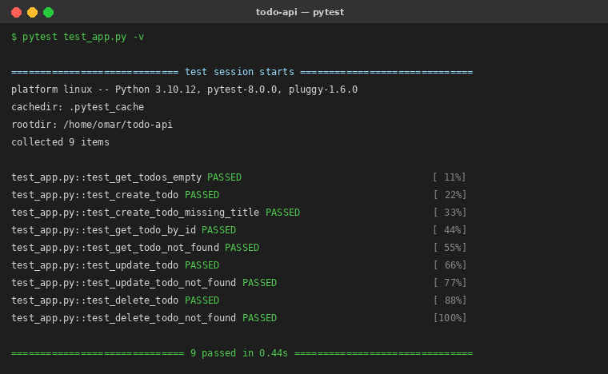

# Todo API — Flask + SQLite

API REST minimaliste de gestion de tâches (Todo), développée avec **Flask** et **SQLite**, couverte par des **tests unitaires `pytest`**. Projet réalisé dans le cadre du module *Développement et Tests de l'Application Python* (TP DevSecOps).

[](docs/pytest_screenshot.png)
[](https://www.python.org/)
[](https://flask.palletsprojects.com/)

---

## Sommaire

1. [Architecture du projet](#1-architecture-du-projet)
2. [Prérequis](#2-prérequis)
3. [Installation pas à pas (et pourquoi)](#3-installation-pas-à-pas-et-pourquoi)
4. [Lancer l'application](#4-lancer-lapplication)
5. [Documentation des endpoints](#5-documentation-des-endpoints)
6. [Tests manuels avec curl](#6-tests-manuels-avec-curl)
7. [Tests unitaires avec pytest](#7-tests-unitaires-avec-pytest)
8. [Sécurité et bonnes pratiques](#8-sécurité-et-bonnes-pratiques)
9. [Commandes Git / GitHub utilisées](#9-commandes-git--github-utilisées)

---

## 1. Architecture du projet

```
todo-api/
├── app.py              # Application Flask : routes CRUD + accès SQLite
├── requirements.txt    # Dépendances Python épinglées
├── test_app.py         # Tests unitaires pytest (9 tests, 1 par cas)
├── .gitignore          # Exclut la base SQLite, le venv, les caches, les secrets
├── README.md           # Ce fichier
└── docs/
    ├── pytest_screenshot.png   # Preuve : capture de l'exécution des tests
    └── tests_output.txt        # Sortie texte brute de pytest -v
```

| Composant | Rôle |
|-----------|------|
| `Flask` | Micro-framework web : route les requêtes HTTP vers les fonctions Python. |
| `SQLite` | Base de données embarquée (un simple fichier `todos.db`), zéro serveur à installer. |
| `pytest` | Framework de tests : exécute les tests et fournit un rapport lisible. |

---

## 2. Prérequis

- **Python 3.10 ou supérieur** (`python --version` pour vérifier)
- **pip** (gestionnaire de paquets Python, livré avec Python)
- Le port **5000** doit être libre

---

## 3. Installation pas à pas (et pourquoi)

### 3.1. Récupérer le projet

```bash
git clone https://github.com/<votre-compte>/tp-devsecops-todo-api.git
cd tp-devsecops-todo-api
```

> *Pourquoi :* on récupère le code et on se place dans le dossier pour que toutes les commandes suivantes s'exécutent au bon endroit.

### 3.2. Créer un environnement virtuel

```bash
python -m venv .venv
# Linux / macOS
source .venv/bin/activate
# Windows (PowerShell)
.venv\Scripts\Activate.ps1
```

> *Pourquoi :* un environnement virtuel isole les dépendances du projet du Python système. On évite les conflits de versions entre projets et on garde une installation propre et reproductible.

### 3.3. Installer les dépendances

```bash
pip install -r requirements.txt
```

> *Pourquoi :* `requirements.txt` épingle des versions précises (`Flask==3.0.0`, `pytest==8.0.0`). Tout le monde installe donc exactement les mêmes versions → le projet se comporte de façon identique sur toutes les machines.

---

## 4. Lancer l'application

```bash
python app.py
```

Au démarrage, l'application :

- crée automatiquement la base SQLite `todos.db` (via `init_db()`) si elle n'existe pas ;
- écoute sur `http://localhost:5000`.

L'API est alors accessible sur **http://localhost:5000/todos**.

> *Astuce :* le chemin de la base est configurable via la variable d'environnement `DB_PATH`.
> `DB_PATH=/tmp/ma_base.db python app.py` lance l'API sur une autre base — c'est ce mécanisme qu'on réutilise dans les tests.

---

## 5. Documentation des endpoints

Base URL : `http://localhost:5000`

| Méthode | Endpoint | Description | Corps attendu | Codes de retour |
|---------|----------|-------------|---------------|-----------------|
| `GET` | `/todos` | Liste toutes les tâches | — | `200` |
| `POST` | `/todos` | Crée une tâche | JSON avec `title` (requis), `description`, `done` | `201`, `400` |
| `GET` | `/todos/<id>` | Récupère une tâche par son id | — | `200`, `404` |
| `PUT` | `/todos/<id>` | Met à jour une tâche | JSON `title`, `description`, `done` | `200`, `400`, `404` |
| `DELETE` | `/todos/<id>` | Supprime une tâche | — | `200`, `404` |

### Modèle de données `todo`

| Champ | Type | Description |
|-------|------|-------------|
| `id` | entier | Identifiant auto-incrémenté |
| `title` | texte | Titre de la tâche **(obligatoire)** |
| `description` | texte | Description libre |
| `done` | booléen | Tâche terminée ou non (`false` par défaut) |
| `created_at` | timestamp | Date de création (auto) |

### Exemple de réponse (`GET /todos/1`)

```json
{
  "id": 1,
  "title": "Apprendre DevSecOps",
  "description": "Module 4 TP",
  "done": false,
  "created_at": "2026-06-25 08:30:00"
}
```

---

## 6. Tests manuels avec curl

> Avec l'application lancée dans un terminal, exécuter ces commandes dans un second terminal.

```bash
# Créer une tâche
curl -X POST -H "Content-Type: application/json" \
  -d '{"title": "Apprendre DevSecOps", "description": "Module 4 TP"}' \
  http://localhost:5000/todos

# Lister les tâches
curl http://localhost:5000/todos

# Récupérer une tâche
curl http://localhost:5000/todos/1

# Mettre à jour une tâche
curl -X PUT -H "Content-Type: application/json" \
  -d '{"title": "Apprendre DevSecOps - Mise à jour", "done": true}' \
  http://localhost:5000/todos/1

# Supprimer une tâche
curl -X DELETE http://localhost:5000/todos/1
```

> *Pourquoi :* `-X` choisit la méthode HTTP, `-H "Content-Type: application/json"` indique au serveur que le corps est du JSON (sinon l'API renvoie `400 Request must be JSON`), et `-d` fournit ce corps.

---

## 7. Tests unitaires avec pytest

### Commande

```bash
pytest test_app.py -v
```

### Résultat attendu

```text
test_app.py::test_get_todos_empty PASSED
test_app.py::test_create_todo PASSED
test_app.py::test_create_todo_missing_title PASSED
test_app.py::test_get_todo_by_id PASSED
test_app.py::test_get_todo_not_found PASSED
test_app.py::test_update_todo PASSED
test_app.py::test_update_todo_not_found PASSED
test_app.py::test_delete_todo PASSED
test_app.py::test_delete_todo_not_found PASSED

============================== 9 passed ==============================
```



### Stratégie de test (pourquoi ça marche)

- **Base isolée :** on positionne `DB_PATH` vers un fichier temporaire **avant** d'importer `app`. Comme `app.py` lit `DB_PATH` à l'import, les tests n'écrivent jamais dans la vraie base `todos.db`.
- **Fixture `client` :** avant chaque test, on supprime puis recrée la base. Chaque test démarre donc sur une base vierge → tests **indépendants** et **reproductibles** (l'`id` auto-incrément repart toujours de 1).
- **`app.test_client()` :** le client de test Flask simule des requêtes HTTP **sans lancer de vrai serveur**, ce qui rend les tests rapides.
- **Couverture :** 1 test nominal + 1 test d'erreur (`400` / `404`) par endpoint → on valide aussi bien le « chemin heureux » que la gestion d'erreurs.

| Test | Ce qu'il vérifie |
|------|------------------|
| `test_get_todos_empty` | Liste vide au départ (`200`, `[]`) |
| `test_create_todo` | Création réussie (`201`, objet renvoyé) |
| `test_create_todo_missing_title` | `title` manquant → `400` |
| `test_get_todo_by_id` | Lecture d'une tâche existante (`200`) |
| `test_get_todo_not_found` | Id inexistant → `404` |
| `test_update_todo` | Mise à jour + persistance (`200`) |
| `test_update_todo_not_found` | Update d'un id inexistant → `404` |
| `test_delete_todo` | Suppression (`200`, puis `404`) |
| `test_delete_todo_not_found` | Delete d'un id inexistant → `404` |

---

## 8. Sécurité et bonnes pratiques

- ✅ **Aucun secret dans le code** (pas de mot de passe ni token en dur).
- ✅ **`todos.db` n'est pas versionné** : la base SQLite est listée dans `.gitignore` (une base n'a rien à faire dans Git, et elle pourrait contenir des données).
- ✅ **Requêtes SQL paramétrées** (`?`) : protège contre les injections SQL.
- ✅ **Versions épinglées** dans `requirements.txt` pour des builds reproductibles.
- ⚠️ `debug=True` est pratique en développement mais **doit être désactivé en production**.

---

## 9. Commandes Git / GitHub utilisées

```bash
# Initialisation du dépôt
git init
git add .
git commit -m "Initial commit : API Todo Flask + SQLite + tests pytest"

# Liaison au dépôt distant et premier push
git branch -M main
git remote add origin https://github.com/<votre-compte>/tp-devsecops-todo-api.git
git push -u origin main
```

> *Pourquoi :* `git init` crée le dépôt local, `add` + `commit` enregistrent un instantané du code, `remote add origin` relie le projet à GitHub, et `push -u origin main` envoie le code en publiant la branche `main` comme branche de suivi par défaut.

---

*Réalisé par BENFDILA Omar — TP Développement et Tests de l'Application Python.*
